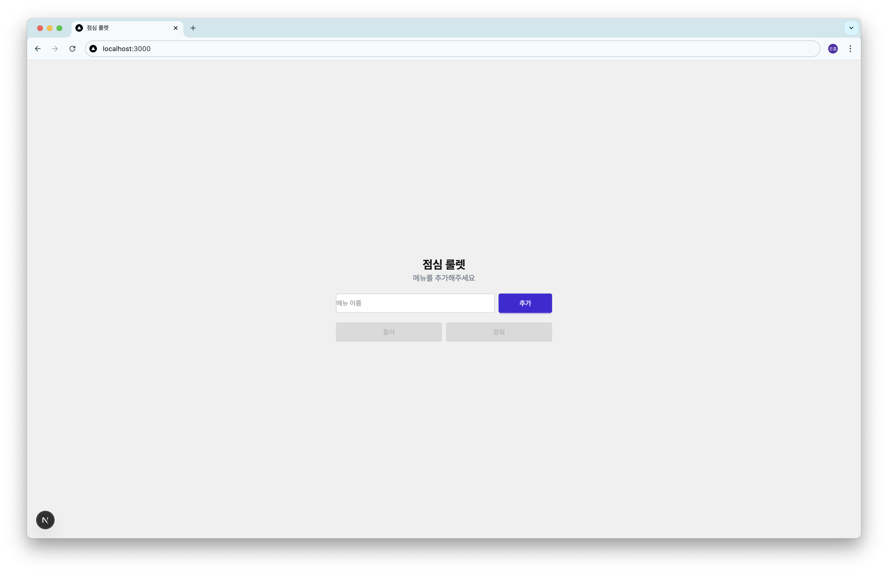
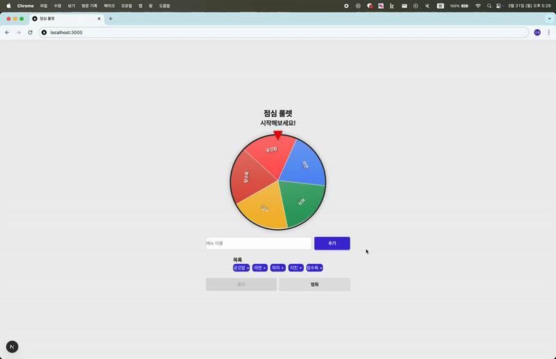
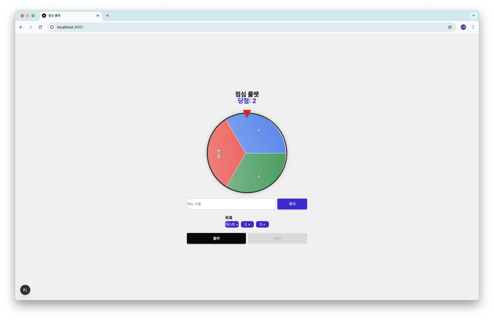

# 점심 룰렛 🍽️

점심 메뉴를 고르기 어려울 때 사용하는 룰렛 애플리케이션입니다.

## 주요 기능 ✨

- 메뉴 추가/삭제
- 룰렛 회전 애니메이션
- 당첨 메뉴
- 반응형 디자인

## 스크린샷 📸

### 룰렛 메인 화면



### 룰렛 회전 중 화면



### 당첨 메뉴 발표 화면



## 기술 스택 🛠️

- Next.js 14
- TypeScript
- Tailwind CSS

## 시작하기 🚀

1. 저장소 클론

```bash
git clone https://github.com/yourusername/lunch-roulette.git
cd lunch-roulette
```

2. 의존성 설치

```bash
npm install
# or
yarn install
```

3. 개발 서버 실행

```bash
npm run dev
# or
yarn dev
```

4. 브라우저에서 확인

```
http://localhost:3000
```

## 사용 방법 📝

1. 메뉴 추가

   - "추가" 버튼을 클릭하여 메뉴 이름 입력
   - Enter 키를 눌러 추가

2. 룰렛 실행

   - "돌려" 버튼을 클릭하여 룰렛 회전 시작
   - "멈춰" 버튼을 클릭하여 당첨메뉴 선정

3. 결과 확인
   - 당첨된 메뉴의 이름이 화면에 표시됨
   - 룰렛이 해당 메뉴 위치에서 멈춤

## 라이선스 📄

MIT License
